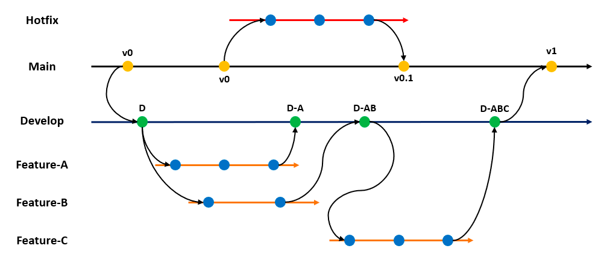

# java-aqa-course

Java automation quality assurance course

#### Session 9 covers

**GIT Basics**

_Applicable for MacOS_

1. Open the terminal
2. Type in the terminal `git --version`
3. If u see output similar to `git version 2.32.1 `
   that means that u have GIT already installed on your machine, Otherwise
   install it typing `brew install git`

Git Workflow:

Branching:

5. Clone repo:
   `git clone git@<gitserver.com>:<ORG>/<PROJECT>.git`

example:
`git clone git@github.com:nick-mlnk/java-aqa-course.git`

6. To start work on updates/changes create and switch to the new branch:

`git checkout -b <BRANCH_NAME>`

7. After u make some changes in your local repo(working copy) u can check the status:
`git status` or `git status -uall`

9. Add file or all files to the staging area:
   `git add <file.ext>` or `git add .`
10. To commit the changes:
    `git commit -m "<YOUR_MESSAGE>"`
11. To view log details:
    `git log`
12. To view commit details:
    `git show <COMMIT_HASH>`
13. To commit the changes with overwriting the last commit:
    `git commit --amend -m "<YOUR_MESSAGE>"`
14. Push your changes to remote repo:
    `git push`; for GITHUB using PAT: `git push https://<PAT>@github.com/<ORG>/<PROJECT>.git`
15. Fetch the latest changes from master branch(remote repo):
    `git pull origin master` or from another branch `git pull origin <BRANCH_NAME`
16. Just to hide your changes to stack _without committing_:
    `git stash`
17. To return your hidden changes from stack:
    `git stash pop`
18. To revert to previous commit or predefined commit:
    `git reset --hard HEAD^1` or `git reset --hard <HASH_COMMIT>`
19. Rename branch:
    `git branch -m <OLD_BRANCH_NAME> <NEW_BRANCH_NAME>`
20. Delete branch:
    `git branch -D <BRANCH_NAME>`
21. Fetch origin branch:
    `git fetch origin <BRANCH_NAME`
22. Merge branch in your current branch:
    `git merge <BRANCH_NAME>`

[GIT Tutorial](https://www.tutorialspoint.com/git/)

[GIT Helper](https://gitexplorer.com/)
