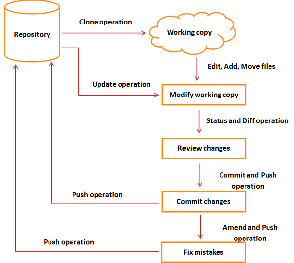

# java-aqa-course

Java automation quality assurance course

#### Session 9 covers

**GIT Basics**

1. Open the terminal
2. Type in the terminal `git --version`
3. If u see output similar to `git version 2.32.1 `
   that means that u have GIT already install on your machine, Otherwise
   install it typing `brew install git`
4. Git Workflow:

5. Clone repo:
   `git clone git@<gitserver.com>:<ORG>/<PROJECT>.git`

example:
`git clone git@github.com:nick-mlnk/java-aqa-course.git`

6. To start work on updates/changes create and switch to the new branch:

`git checkout -b <BRANCH_NAME>`

7. After u make some changes in your local repo(working copy) u can check the status:
`git status` or `git status -uall`

